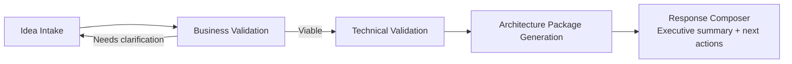

# Application Overview

## What is AI Value Hub?

AI Value Hub is a reference platform that takes an AI use case from a raw idea to a validated, architecture-ready proposal. It gives organizations a structured, auditable pipeline instead of ad-hoc spreadsheets or slide decks for AI initiative intake.

## How it works — end-to-end flow

1. **Idea Intake** — a user (via demo login) submits an idea with a short description and expected business impact.
2. **Context Engine** — each tenant has a business/technical context baseline (industry, risk tolerance, existing stack). The engine uses this context to score the idea.
3. **Business Validation** — produces a value score, a risk score, and either a "viable" outcome, a rejection with reason, or a request for clarification (with suggested answers).
4. **Technical Validation** — for business-viable ideas, a dedicated endpoint assesses technical feasibility against the same context.
5. **Architecture Package Generation** — produces components, integrations, risks, and deployment steps for the use case.
6. **Response Composer** — assembles an executive summary and recommended next actions for the requester.

Every idea keeps a full case state (stage + status + rejection reason) so it can be audited at any point in the pipeline.

## Core components

| Component | Location | Responsibility |
|---|---|---|
| Frontend | `frontend/` | React + Vite UI: login, idea capture, "My ideas", technical hub, admin views |
| API | `api/app/` | FastAPI app exposing all business/technical workflows |
| Context Engine | `api/app/` (context endpoints) | Per-tenant business/technical baseline used for scoring |
| Persistence | `data/` (SQLite) | Idea/case state, context metadata; designed to evolve to PostgreSQL |
| Blob storage | `api/app/blob_storage.py` | Context documents and generated artifacts (Azure Blob or local fallback) |
| Infrastructure | `infra/` | Bicep templates for Azure foundation (Container Apps, Storage, Key Vault, etc.) |
| Automation | `scripts/` | Demo seeding and Fabric/Power BI sync helpers |

See the [Component Architecture Diagram](../architecture-diagram.html) for the full interactive technical view, and the [Flow Diagram](../ai-value-hub-demo.html) for a visual walkthrough.

## Authentication model
- Demo bearer-token auth is active by default (`AIHUB_AUTH_PROVIDER=demo`), with per-user idea isolation.
- Microsoft Entra ID is a first-class extension point in code (`AIHUB_AUTH_PROVIDER=entra`); the production Entra flow is not yet wired in and returns `501` until completed.

## Roles supported today
- **Analyst** — submits ideas, sees only their own ideas.
- **Technical** — reviews the technical validation queue across the tenant.
- **Admin** — manages tenant context, views the approved use-case portfolio, tokens/cost, and metrics.

---

## Roadmap

The items below are not implemented yet. They are grouped by what's closest to existing capabilities versus what requires new development.

### Extends existing capabilities (lower effort)
- **Role-based recommendations and filtering** — the role model (analyst/technical/admin) and tenant isolation already exist; extending this into a catalog-style filtered view is a natural next step.
- **Download / adoption metrics** — idea lifecycle and per-user/tenant activity are already tracked; surfacing these as adoption counters is planned as part of the Admin Center (tokens/cost/ROI metrics).

### Requires new development
- **Community voting / upvoting** — no voting model exists today; would require a vote/aggregation schema and UI surface.
- **User comments and reviews** — no comment/thread model exists; would require a comment schema, moderation considerations, and UI.
- **Publication workflow** (draft → published → versioned) — today an idea's state is tenant-internal (business/technical validation lifecycle). A marketplace scenario where assets are published for cross-team discovery and download requires a new publication/versioning workflow — this is the largest gap for a marketplace scenario.
- **Multi-tenant IaC and packaged per-client deployment** — the current Bicep foundation provisions a single environment; packaging this per customer/tenant with automated provisioning is future work.

### Longer-term
- Admin Center with full token/cost/ROI governance and prompt versioning.
- Company Context Engine enrichment: structured document ingestion (PDF/Word/PPT), semantic indexing, and retrieval-augmented context.
